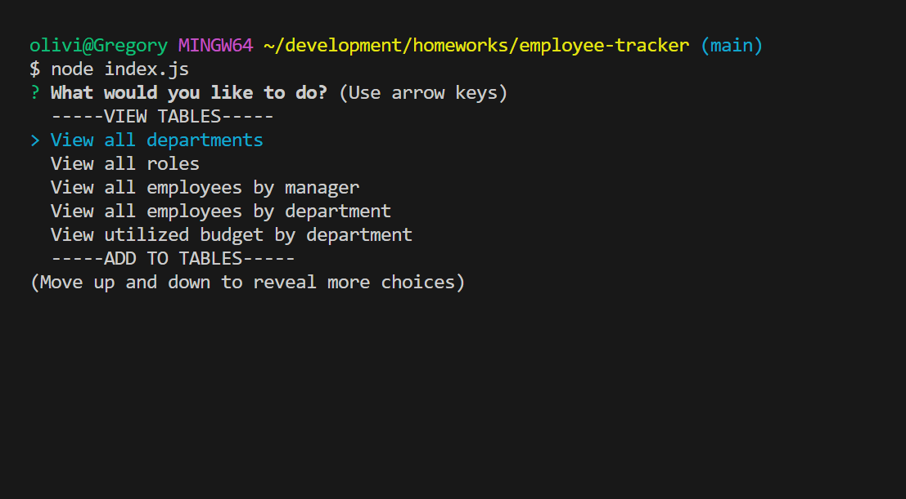
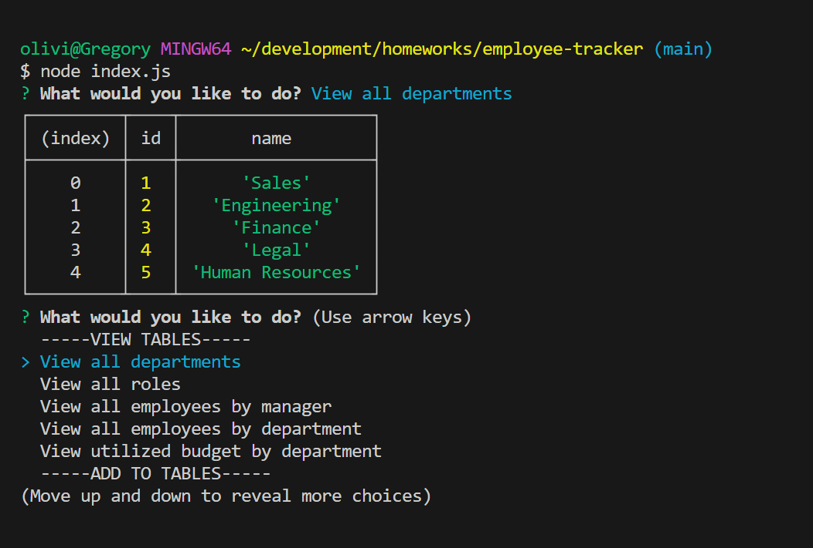

# Employee Tracker

 
  
  ## Table of Contents
  - [Project description](#description)
  - [Installation](#installation)
  - [Usage](#usage)
  - [Questions](#questions)
  - [License](#license)
    
  ## Description 
  Using Mysql, Node.js, and Inquirer to create a back-end application that helps track departments, and employee roles in a database.

  ## Installation 
  To install start by doing a git clone with the repository link in your terminal, install all the npm packages with  
  
    npm i 
  
  and then to start the server run 
  
    node index.js

[Walktrough Video](https://youtu.be/abnraIbdd4U)

  ## Usage 
  Once running select from any of the choices in the main menu and you will be shown a table with the results of your selection. You may be able to insert data if you are prompted to do so and it will add it to the already existing table. 

  
  

  ## Questions
  If there are any additional questions you can email me at oliviaschif@gmail.com
  don't forget to check out my other repositories at [livschif](https://github.com/livschif) on GitHub!

  ## License
  MIT_License